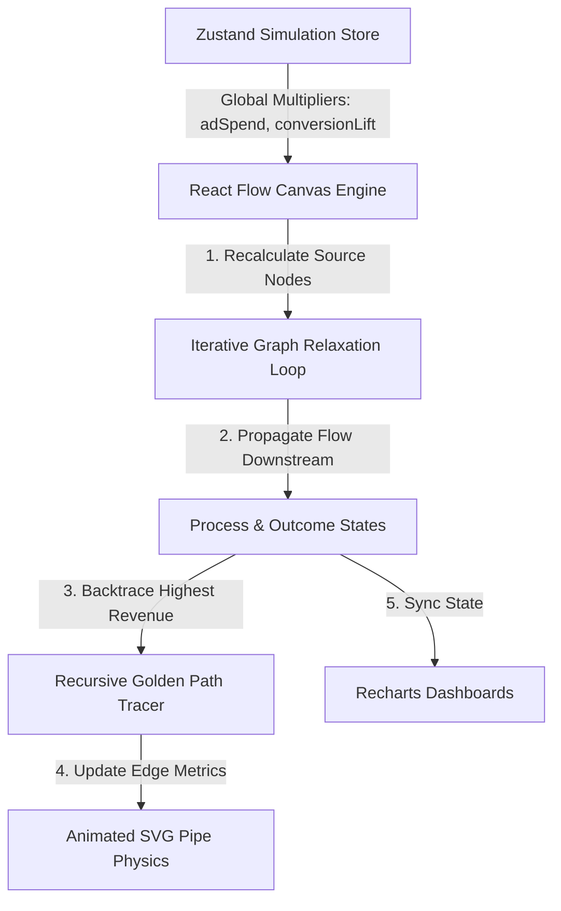

# LeadFlow - Marketing Pipeline Simulator

[](https://nextjs.org/)
[](https://reactflow.dev/)
[](https://github.com/pmndrs/zustand)
[](https://tailwindcss.com/)
[](LICENSE.md)

**An interactive visualisation and simulation engine that models complex marketing funnels, traces ROI paths, and forecasts revenue impacts in real-time.**

> [!NOTE]
> **Codebase Visibility Notice**: This repository acts as a public-facing architectural showcase, design overview and code review documentation. The full source code is closed-source and maintained under a private commercial repository.

*   **Live Demo**: [lead-flow-ivory.vercel.app](https://lead-flow-ivory.vercel.app/)
*   **Case Study & Insights**: [nicolaberry.uk/work/lead-flow](https://nicolaberry.uk/work/lead-flow)

---

## 📸 The Platform in Action


*The interactive simulation canvas displaying multi-channel traffic sources propagating flow downstream through conversion processes to high-ticket deal outcomes.*


*The dynamic comparative dashboard visualising the "Optimisation Gap" between baseline actuals and simulated growth scenarios.*

---

## 🎯 The Business Case

When pitching high-value marketing services or budget increases, static PDF reports and complex spreadsheets fail to communicate ROI. LeadFlow turns marketing analytics into an interactive visual story:

1.  **Map Reality**: Drag and drop traffic sources, webinar pages, and email sequences to build a 1:1 replica of a company's marketing engine.
2.  **Highlight Leaks**: Visual alerts flash red at nodes experiencing severe conversion drops, calculating lost revenue immediately.
3.  **Simulate Optimisations**: Slide the **Ad Spend** or **Conversion Lift** controls to see how changes cascade. Simulated particles (blue/green) flow dynamically alongside baseline "ghost" particles (white) to show the visual gap.
4.  **Close the Deal**: Click **Export Business Case** to output a high-fidelity PDF detailing the exact revenue delta, proving the value of marketing optimization.

---

## ⚙️ Technical Architecture & Data Flow

LeadFlow is built on top of a highly responsive client-side architecture designed to handle graph recalculations in under 16ms, ensuring smooth 60fps animations.



---

## 🧠 Core Algorithmic Highlights

To demonstrate my technical execution in React, TypeScript, and state management, the code segments below outline the primary math and graph algorithms powering the canvas.

### 1. Iterative Graph Relaxation (Flow Propagation)
Because marketing funnels are structured as Directed Acyclic Graphs (DAGs) with potentially multiple entry points and branches, LeadFlow uses a multi-pass edge relaxation algorithm. This iterates downstream from sources to calculate both simulated (live) and baseline (historical) visitor metrics.

```typescript
// Excerpt from BuilderCanvas.tsx - Iterative Flow Relaxation
// 10 passes ensure full propagation down the funnel to outcome nodes
for (let k = 0; k < 10; k++) {
    const nextStepFlows = new Map<string, number>();
    const nextStepBaseFlows = new Map<string, number>();

    // Sources always provide constant entry flow (simulated vs base)
    nds.filter(n => n.type === 'source').forEach(n => {
        nextStepFlows.set(n.id, computed.get(n.id) || 0);
        nextStepBaseFlows.set(n.id, computedBase.get(n.id) || 0);
    });

    // Traverse all active edges to relax nodes
    edges.forEach(edge => {
        const sourceFlow = computed.get(edge.source) || 0;
        const sourceBaseFlow = computedBase.get(edge.source) || 0;
        const sourceNode = nodeMap.get(edge.source);

        let flowToSend = sourceFlow;
        let baseFlowToSend = sourceBaseFlow;

        // Apply node-specific conversion rate if it's a process node
        if (sourceNode?.type === 'process') {
            const rate = (sourceNode.data.conversionRate as number) ?? 100;
            flowToSend = Math.floor(sourceFlow * (rate / 100));
            baseFlowToSend = Math.floor(sourceBaseFlow * (rate / 100));
        }

        // Accumulate visitor counts at the target node
        nextStepFlows.set(edge.target, (nextStepFlows.get(edge.target) || 0) + flowToSend);
        nextStepBaseFlows.set(edge.target, (nextStepBaseFlows.get(edge.target) || 0) + baseFlowToSend);
    });

    // Commit values to local maps for the next relaxation step
    nextStepFlows.forEach((val, id) => {
        if (nodeMap.get(id)?.type !== 'source') computed.set(id, val);
    });
    nextStepBaseFlows.forEach((val, id) => {
        if (nodeMap.get(id)?.type !== 'source') computedBase.set(id, val);
    });
}
```

### 2. Recursive Backtracing (The "Golden Path" Identifier)
Once all nodes have computed their final outcomes, the system needs to trace the "Golden Path"- the most profitable route in the system. It identifies the highest-earning outcome node and recursively traces backward along the edges with the highest throughput.

```typescript
// Excerpt from BuilderCanvas.tsx — Backtracing Algorithm
// 1. Identify the highest-revenue outcome node
const outcomes = nodes.filter(n => n.type === 'outcome');
let bestOutcome = outcomes[0];
outcomes.forEach(o => {
    if (((o.data.revenue as number) || 0) > ((bestOutcome?.data?.revenue as number) || 0)) {
        bestOutcome = o;
    }
});

// 2. Backtrace from the highest-performing node to the source
const goldenEdgeIds = new Set<string>();
if (bestOutcome) {
    let current = bestOutcome;
    // Walk back up to 10 steps to prevent cycles
    for (let k = 0; k < 10; k++) {
        // Find all incoming edges to the current node
        const incoming = updatedEdges.filter(e => e.target === current.id);
        if (incoming.length === 0) break;

        // Find the incoming edge that contributed the highest throughput
        let bestEdge = incoming[0];
        incoming.forEach(e => {
            if (((e.data?.throughput as number) || 0) > ((bestEdge?.data?.throughput as number) || 0)) {
                bestEdge = e;
            }
        });

        if (bestEdge) {
            goldenEdgeIds.add(bestEdge.id);
            // Move current pointer to the source of that edge
            const sourceNode = nodes.find(n => n.id === bestEdge.source);
            if (sourceNode) current = sourceNode;
            else break;
        }
    }
}
```

### 3. Visual SVG Pipe Physics
To represent data flow physically, a custom React Flow edge component (`AnimatedPipeEdge.tsx`) renders SVG paths. Inside, SVG circles act as flowing particles:
*   **Animation Speed**: Calculated using CSS custom properties bound to the node's throughput: `animationDuration = Math.max(2, 10 - (throughput / 1000)) + 's'`.
*   **Particle Density**: Managed by rendering different combinations of stroke arrays based on active simulation states.

---

## 🛠️ Stack & Implementation Details

| Layer | Technologies | Purpose |
| :--- | :--- | :--- |
| **Framework** | Next.js 15 (App Router) | React Server Components, Server-side routing, static optimisations |
| **Visual Canvas** | React Flow (xyflow) | Node canvas, customised drag-and-drop handles, viewport controls |
| **State Engine** | Zustand | Global simulation store, parameter caching, side-effect propagation |
| **Styling** | Tailwind CSS v4 | Strict glassmorphism aesthetics, variables-first theme bindings |
| **Charting** | Recharts | High-performance rendering of comparative revenue timelines |
| **PDF Engine** | html2canvas + jsPDF | Dynamic rasterisation of active canvas and wrapping into client proposals |

---

## Let's Discuss
If you are looking to hire a full-stack engineer who specialises in **advanced React systems, interactive data visualisation, and resilient architecture**, let's connect:

*   **Portfolio**: [nicolaberry.uk](https://nicolaberry.uk)
*   **Email**: [nicola@empowerdigitalsolutions.co.uk](mailto:nicola@empowerdigitalsolutions.co.uk)

---
*LeadFlow © 2026. Built by Nicola Berry.*
